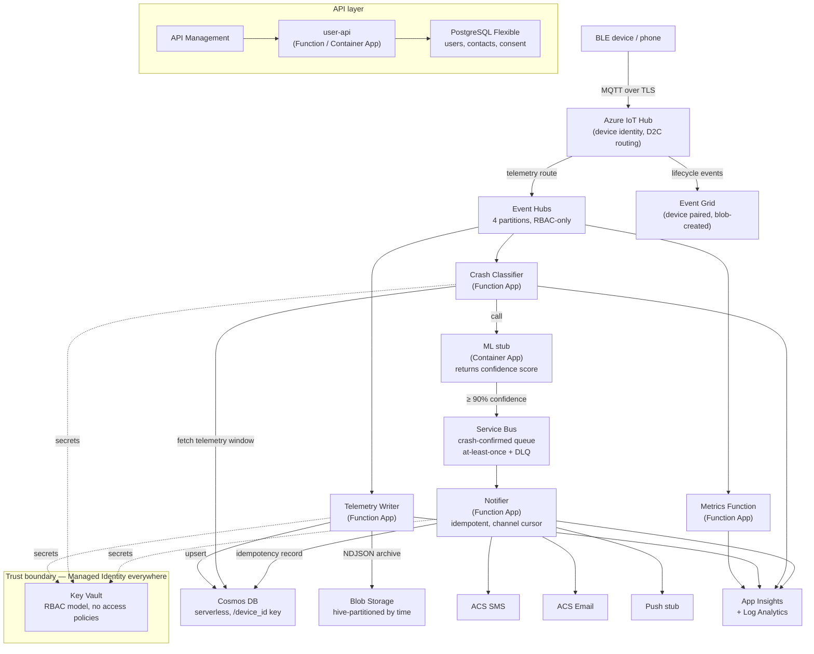

# GuardianLink — Azure IoT Safety Platform

[](https://dev.azure.com/eyal050/guardianlink/_build?definitionName=tests)

A reference architecture for a connected personal safety platform: wearable devices stream telemetry to Azure, an ML-backed crash classifier confirms incidents, and emergency contacts are notified within seconds via SMS, email, and push.

Built end-to-end with Terraform, Azure DevOps, and full observability. Every resource authenticates via managed identity — no connection strings, no stored credentials.

---

## Architecture



See [`docs/architecture.md`](docs/architecture.md) for full component detail and all recorded design decisions.

---

## Design decisions worth asking about

**Why IoT Hub in front of Event Hubs?**
Device identity, per-device quotas, and the D2C routing model. A connected safety device fleet needs bidirectional comms and a device registry — raw Event Hubs has neither.

**Why three eventing backbones?**
Different SLOs require different semantics:
- **Event Hubs** for device telemetry — high throughput, partitioned by `deviceId`, replayable so the classifier can re-run over historical windows.
- **Service Bus** for crash notifications — at-least-once + DLQ because a missed crash alert is a safety failure. The notifier is idempotent to tolerate redelivery.
- **Event Grid** for lifecycle events — push-based reactive Functions at low volume, platform system-topics are Event Grid-native.

**Why managed identity everywhere?**
`local_authentication_enabled = false` on Event Hubs and Service Bus, `local_authentication_disabled = true` on Cosmos DB. Every service-to-service call authenticates through Entra ID. The only secrets in Key Vault are externally-issued credentials (ACS, Postgres password).

**Why separate Function Apps per workload?**
The crash classifier and notifier have different SLOs and cannot share fate. A classifier cold start should never delay a notification. An overloaded telemetry writer should not block crash detection.

**Why PaaS (Functions) over AKS for this workload profile?**
The application's scaling and operational profile — stateless, event-triggered, bursty dev volumes — fits Functions better than a long-running pod. This is a deliberate decision, not a knowledge gap. An AKS-based variant of the consumer path (Key Vault CSI driver, HPA, network policies) is on the roadmap to demonstrate the alternative pattern where it's actually justified.

**Why OIDC for CI/CD?**
No stored service principal secrets in Azure DevOps. The infra pipeline federates with Entra ID via Workload Identity — the credential rotates automatically and there is nothing to leak.

**Why Cosmos DB serverless with `/device_id` partition key?**
The dev workload is bursty and the stack is destroyed nightly — paying-per-RU beats paying for an idle autoscale floor. Partition key is driven by the dominant read pattern: "last N minutes of telemetry for device X" is a single-partition lookup with a time-range filter.

---

## Stack

| Layer | Technology |
|---|---|
| Device ingestion | Azure IoT Hub |
| Telemetry streaming | Azure Event Hubs (4 partitions, RBAC-only) |
| Crash notification pipeline | Azure Service Bus (at-least-once + DLQ) |
| Lifecycle events | Azure Event Grid |
| Processing | Azure Functions (Python v2 model) |
| ML classifier stub | Azure Container Apps |
| Hot store | Cosmos DB (serverless, Core SQL API) |
| Cold archive | Blob Storage (NDJSON, hive-partitioned) |
| Relational store | PostgreSQL Flexible Server |
| API edge | Azure API Management |
| Secrets | Key Vault (RBAC, no access policies) |
| Observability | App Insights + Log Analytics + Azure Monitor Workbook |
| Alerting | Azure Monitor scheduled-query rules (KQL) |
| IaC | Terraform ≥ 1.7 |
| CI/CD | Azure DevOps (OIDC — no stored credentials) |
| Device simulator | Python async (`azure-iot-device`) |

---

## Repo layout

```
guardian-link/
├── apps/
│   ├── simulator/              # Python device simulator (sim-01, sim-02)
│   ├── consumer/               # Python Event Hub inspector
│   ├── telemetry-writer/       # Azure Function
│   ├── crash-classifier/       # Azure Function + ML stub
│   ├── notifier/               # Azure Function (idempotent, ACS)
│   └── metrics/                # Azure Function
├── terraform/
│   ├── environments/dev/       # deployed stack; see docs/terraform-structure.md
│   ├── environments/staging/   # stub — shows module consumption pattern
│   ├── environments/prod/      # stub — shows prod-specific overrides
│   └── modules/                # reusable modules: observability, iot, eventhub, servicebus, functions
├── pipelines/                  # Azure DevOps pipeline YAMLs
├── alerts/                     # KQL files for Azure Monitor alert rules
├── dashboards/                 # Azure Monitor workbook JSON
├── docs/
│   ├── architecture.md         # full component detail + all recorded decisions
│   ├── terraform-structure.md  # environment promotion model
│   └── failure-scenarios.md    # break/debug catalog (the primary learning exercise)
├── AI_WORKFLOW.md              # AI-augmented development methodology
└── SETUP.md                    # prerequisites, Terraform variables, ADO setup, simulator commands
```

---

## Roadmap

- AKS-based variant of the telemetry consumer path (Key Vault CSI driver, HPA, network policies)
- Staging + production environment separation with Terraform module structure and promotion pipeline
- Integration test suite covering the simulator → IoT Hub → Event Hub → Cosmos path
- Real ML model replacing the classifier stub

---

## Testing

**Unit tests** — 44 tests across 6 apps, covering classifier scoring, telemetry transformation, notifier idempotency, and metric logging. Each app's tests use mocked Azure SDK clients and run independently:

```bash
./scripts/run-tests.sh          # all apps
./scripts/run-tests.sh --cov    # with per-app coverage report
```

**Integration tests** — documented scenarios in `tests/` for the full pipeline (device → IoT Hub → Cosmos) and alert path (crash_suspect → classifier → notifier). Require a live Azure environment:

```bash
pytest tests/ --integration
```

The CI pipeline (`pipelines/tests.yml`) runs unit tests and linting on every pull request, publishing JUnit results and coverage to Azure DevOps.

---

## Failure injection

[`docs/failure-scenarios.md`](docs/failure-scenarios.md) catalogs realistic production failures. The workflow: inject a failure, diagnose it using only Azure Monitor and App Insights, write a post-mortem. This is the primary learning exercise in the repo.

---

## Setup

See [`SETUP.md`](SETUP.md) for prerequisites, Terraform variables, ADO variable group configuration, and step-by-step deploy instructions.

---

## Branching & deployment

- **GitHub is the source of truth.** All code lives here; ADO is a one-way mirror used only for pipeline execution.
- `dev` branch: a push (direct or via PR) mirrors to ADO `dev` and deploys to the dev Azure environment.
- `main` branch: protected (PR required, linear history). Merging a PR — typically from `dev` — mirrors to ADO `main` and deploys to the prod Azure environment, gated on manual approval at the ADO `prod` env.
- Do **not** push directly to ADO. The mirror workflow uses `--force-with-lease` and will surface (or overwrite) any out-of-band ADO commits.

Full design: [`docs/superpowers/specs/2026-05-17-branching-strategy-design.md`](docs/superpowers/specs/2026-05-17-branching-strategy-design.md).

---

## AI-augmented workflow

This project was built using an AI-augmented engineering workflow. Architectural decisions, tradeoff analysis, and operational design are mine; Claude Code executed implementation under direction.

See [`AI_WORKFLOW.md`](AI_WORKFLOW.md) for how the collaboration is structured.
