# GuardianLink Flow Diagram

This diagram shows the GuardianLink product flow from device telemetry ingestion through crash confirmation and emergency notification. Each group shows the high-level architectural layer, while each node names the lower-level service or app instance.

```mermaid
%%{init: {'theme': 'default', 'themeVariables': {'fontSize': '18px', 'fontFamily': 'trebuchet ms, verdana, arial'}, 'flowchart': {'nodeSpacing': 60, 'rankSpacing': 100, 'padding': 20}}}%%
flowchart LR
    device["BLE device / mobile app<br/>Instance: guardian device or phone app"]:::deviceNode

    subgraph ingestion["Ingestion layer"]
        iothub["Azure IoT Hub<br/>Instance: guardianlink-iothub<br/>MQTT/HTTPS, device identity, routing"]:::ingestionNode
    end

    subgraph eventing["Eventing backbone"]
        eventhubs["Azure Event Hubs<br/>Instance: telemetry-events<br/>High-volume telemetry stream"]:::eventingNode
        servicebus["Azure Service Bus<br/>Instance: crash-confirmed queue/topic<br/>Durable crash notification path"]:::crashNode
        eventgrid["Azure Event Grid<br/>Instance: lifecycle-events<br/>Device/user/platform events"]:::lifecycleNode
    end

    subgraph processing["Processing layer"]
        telemetryWriter["Azure Function<br/>Instance: telemetry-writer<br/>Consumes telemetry events"]:::telemetryNode
        classifier["Azure Function<br/>Instance: crash-classifier<br/>Consumes crash-suspect events"]:::classifierNode
        metricsFn["Azure Function<br/>Instance: metrics-function<br/>Emits custom metrics"]:::observabilityNode
        notifier["Azure Function<br/>Instance: notifier<br/>Consumes confirmed crash messages"]:::notificationNode
    end

    subgraph ml["ML support layer"]
        mlEndpoint["Azure Container Apps<br/>Instance: ml-endpoint<br/>Crash scoring stub"]:::mlNode
    end

    subgraph storage["Storage layer"]
        cosmos["Azure Cosmos DB<br/>Instance: telemetry-hot-store<br/>Recent telemetry and event lookup"]:::storageNode
        blob["Azure Blob Storage<br/>Instance: raw-telemetry-archive<br/>Raw telemetry, crash evidence, ML data"]:::storageNode
        postgres["PostgreSQL Flexible Server<br/>Instance: user-data-db<br/>Users, contacts, devices, consent"]:::storageNode
    end

    subgraph api["API layer"]
        apim["Azure API Management<br/>Instance: guardianlink-apim<br/>JWT validation, rate limits, public edge"]:::apiNode
        userApi["Azure Function or Container App<br/>Instance: user-api<br/>Profiles, contacts, pairing, consent"]:::apiNode
    end

    subgraph notification["Notification providers"]
        acs["Azure Communication Services<br/>SMS notifications"]:::notificationNode
        sendgrid["SendGrid<br/>Email notifications"]:::notificationNode
        push["Azure Notification Hubs<br/>Push notifications"]:::notificationNode
    end

    subgraph observability["Observability and operations"]
        appInsights["Application Insights<br/>Instance: guardianlink-appi<br/>Traces, dependencies, custom events"]:::observabilityNode
        logAnalytics["Log Analytics Workspace<br/>Instance: guardianlink-law<br/>Central log workspace"]:::observabilityNode
        dashboards["Azure Workbooks / Alerts<br/>Ingestion, latency, failure rate, cost"]:::observabilityNode
        keyVault["Azure Key Vault<br/>Instance: guardianlink-kv<br/>Secrets, keys, provider credentials"]:::securityNode
    end

    mobile["Mobile app user/API client"]:::apiNode

    device -->|"telemetry, heartbeat, crash_suspect"| iothub
    iothub -->|"all device telemetry"| eventhubs
    iothub -->|"device lifecycle events"| eventgrid

    eventhubs --> telemetryWriter
    eventhubs --> classifier
    eventhubs --> metricsFn
    eventgrid --> metricsFn

    telemetryWriter -->|"hot telemetry writes"| cosmos
    telemetryWriter -->|"raw batch archive"| blob

    classifier -->|"read telemetry window"| cosmos
    classifier -->|"score crash candidate"| mlEndpoint
    mlEndpoint -->|"is_crash + confidence"| classifier
    classifier -->|"crash_confirmed"| servicebus
    classifier -->|"crash_rejected / metrics"| appInsights

    servicebus -->|"Service Bus trigger"| notifier
    notifier -->|"lookup contacts"| postgres
    notifier -->|"send SMS"| acs
    notifier -->|"send email"| sendgrid
    notifier -->|"send push"| push
    notifier -->|"notification status/events"| cosmos

    mobile --> apim
    apim --> userApi
    userApi --> postgres
    userApi --> cosmos

    telemetryWriter --> appInsights
    classifier --> appInsights
    notifier --> appInsights
    metricsFn --> appInsights
    appInsights --> logAnalytics
    logAnalytics --> dashboards

    telemetryWriter -. "managed identity / secrets" .-> keyVault
    classifier -. "managed identity / secrets" .-> keyVault
    notifier -. "SendGrid/ACS credentials" .-> keyVault
    userApi -. "managed identity / secrets" .-> keyVault

    classDef deviceNode fill:#e0f2fe,stroke:#0284c7,stroke-width:2px,color:#0f172a;
    classDef ingestionNode fill:#dbeafe,stroke:#2563eb,stroke-width:2px,color:#0f172a;
    classDef eventingNode fill:#ede9fe,stroke:#7c3aed,stroke-width:2px,color:#0f172a;
    classDef lifecycleNode fill:#fef3c7,stroke:#d97706,stroke-width:2px,color:#0f172a;
    classDef telemetryNode fill:#dcfce7,stroke:#16a34a,stroke-width:2px,color:#0f172a;
    classDef classifierNode fill:#fae8ff,stroke:#c026d3,stroke-width:2px,color:#0f172a;
    classDef crashNode fill:#fee2e2,stroke:#dc2626,stroke-width:2px,color:#0f172a;
    classDef notificationNode fill:#ffedd5,stroke:#ea580c,stroke-width:2px,color:#0f172a;
    classDef mlNode fill:#f3e8ff,stroke:#9333ea,stroke-width:2px,color:#0f172a;
    classDef storageNode fill:#ccfbf1,stroke:#0d9488,stroke-width:2px,color:#0f172a;
    classDef apiNode fill:#cffafe,stroke:#0891b2,stroke-width:2px,color:#0f172a;
    classDef observabilityNode fill:#f1f5f9,stroke:#475569,stroke-width:2px,color:#0f172a;
    classDef securityNode fill:#fef9c3,stroke:#ca8a04,stroke-width:2px,color:#0f172a;

    linkStyle 0 stroke:#0284c7,stroke-width:3px;
    linkStyle 1 stroke:#7c3aed,stroke-width:3px;
    linkStyle 2 stroke:#d97706,stroke-width:3px;
    linkStyle 3,4,5 stroke:#16a34a,stroke-width:3px;
    linkStyle 6 stroke:#d97706,stroke-width:3px;
    linkStyle 7,8 stroke:#0d9488,stroke-width:3px;
    linkStyle 9,10,11,12 stroke:#c026d3,stroke-width:3px;
    linkStyle 13,14,15,16,17 stroke:#ea580c,stroke-width:3px;
    linkStyle 18,19,20,21 stroke:#0891b2,stroke-width:3px;
    linkStyle 22,23,24,25,26,27 stroke:#475569,stroke-width:3px;
    linkStyle 28,29,30,31 stroke:#ca8a04,stroke-width:2px,stroke-dasharray:5 5;
```

## Critical Path

1. Device or phone sends telemetry and crash-suspect events to IoT Hub.
2. IoT Hub routes device messages into Event Hubs for high-volume streaming.
3. Telemetry writer stores recent data in Cosmos DB and raw batches in Blob Storage.
4. Crash classifier reads the telemetry window, calls the ML endpoint, and publishes confirmed crashes to Service Bus.
5. Notifier consumes Service Bus messages, loads emergency contacts from PostgreSQL, and sends SMS, email, and push notifications.
6. Application Insights and Log Analytics collect traces, metrics, dependencies, and alerts across the whole flow.
